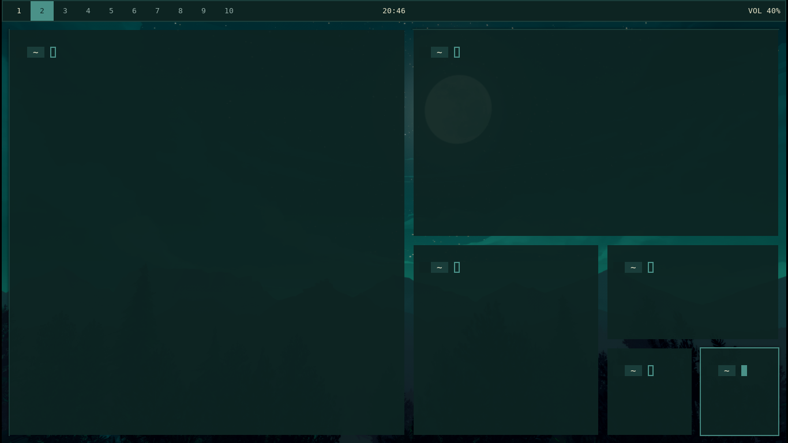
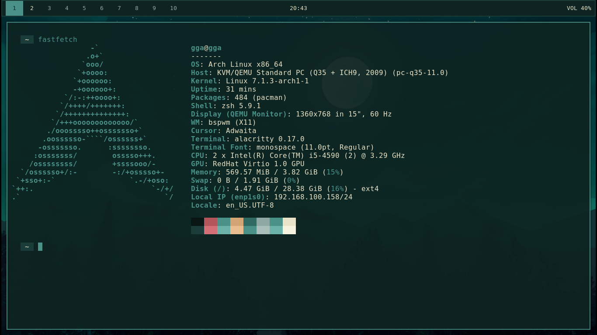

# bspwm-nocturne


A minimal **bspwm** desktop setup themed around a dark teal *forest night* wallpaper — cool teal tones with a warm cream moonlight accent.

## Preview




## Features

- 🌙 Dark teal forest-night color scheme, consistent across every component
- ⚡ Lightweight — no bloated widgets, no unnecessary daemons
- 🎨 Unified theme across bspwm, polybar, alacritty, picom, and zsh
- 📦 Easy install / uninstall via GNU Stow (symlink-based, safe to edit in place)
- 🖥️ VM-friendly picom config (xrender backend, no GPU compositing issues)

## Color Palette

| Name              | Hex       |             |
|--------------------|-----------|-------------|
| Background (deep)  | `#0a1614` | ⬛ |
| Background         | `#0d2422` | ⬛ |
| Border / alt bg    | `#1a3d3a` | 🟦 |
| Secondary accent   | `#2f6b63` | 🟩 |
| Primary accent     | `#4a9188` | 🟩 |
| Foreground (moon)  | `#e8e4c9` | ⬜ |
| Foreground (dim)   | `#8fa8a3` | ⬜ |
| Alert / warm       | `#d4a574` | 🟧 |

## Stack

| Component     | Tool                              |
|---------------|-------------------------------------|
| WM            | bspwm                             |
| Hotkeys       | sxhkd                             |
| Status bar    | polybar                           |
| Compositor    | picom (xrender backend, VM-safe)  |
| Terminal      | alacritty                         |
| Shell         | zsh + oh-my-zsh + starship        |
| Wallpaper     | feh                               |

## Dependencies

```bash
sudo pacman -S bspwm sxhkd polybar picom alacritty zsh feh stow git
```

Optional but recommended:

```bash
sh -c "$(curl -fsSL https://raw.githubusercontent.com/ohmyzsh/ohmyzsh/master/tools/install.sh)"
curl -sS https://starship.rs/install.sh | sh
```

A **Nerd Font** is required for icons in polybar/starship to render correctly:

```bash
sudo pacman -S ttf-jetbrains-mono-nerd
```

## Install

```bash
git clone https://github.com/amine0910/bspwm-nocturne.git ~/dotfiles
cd ~/dotfiles

# back up any existing configs first!
mv ~/.config/bspwm ~/.config/bspwm.bak 2>/dev/null
mv ~/.config/polybar ~/.config/polybar.bak 2>/dev/null
mv ~/.config/alacritty ~/.config/alacritty.bak 2>/dev/null
mv ~/.config/sxhkd ~/.config/sxhkd.bak 2>/dev/null
mv ~/.config/picom ~/.config/picom.bak 2>/dev/null
mv ~/.zshrc ~/.zshrc.bak 2>/dev/null

stow bspwm polybar alacritty sxhkd picom zsh
```

Place the wallpaper wherever `bspwmrc` points to (default: `~/Downloads/`), or edit the `feh` line in `bspwm/.config/bspwm/bspwmrc` to match your own wallpaper path.

Reload bspwm to apply everything:

```bash
bspc wm -r
```

## Uninstall

```bash
cd ~/dotfiles
stow -D bspwm polybar alacritty sxhkd picom zsh
```

This removes the symlinks. Restore your `.bak` folders afterward if needed.

## Notes

- Running in a **VM**? Keep picom's backend as `xrender`, not `glx`, or expect lag/hangs.
- Bar not showing? Make sure the `[bar/...]` name in `polybar/config.ini` matches what `launch.sh` calls (`polybar main`).
- Test config/wallpaper commands from a terminal **inside the bspwm session**, not over SSH — there's no X display over SSH.

## Structure

```
bspwm-nocturne/
├── bspwm/.config/bspwm/bspwmrc
├── polybar/.config/polybar/{config.ini,launch.sh}
├── alacritty/.config/alacritty/alacritty.toml
├── sxhkd/.config/sxhkd/sxhkdrc
├── picom/.config/picom/picom.conf
├── zsh/{.zshrc,.config/starship.toml}
└── screenshots/
```

## License

MIT — see [LICENSE](LICENSE).
